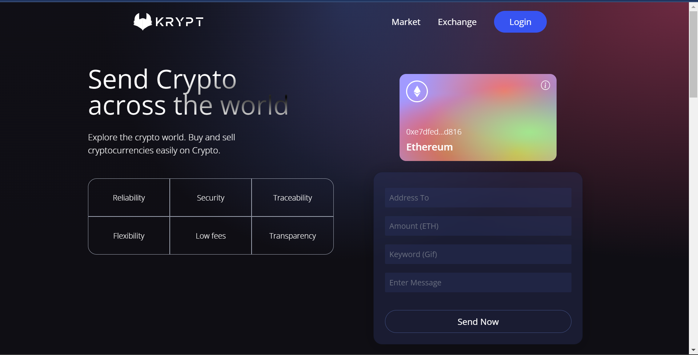
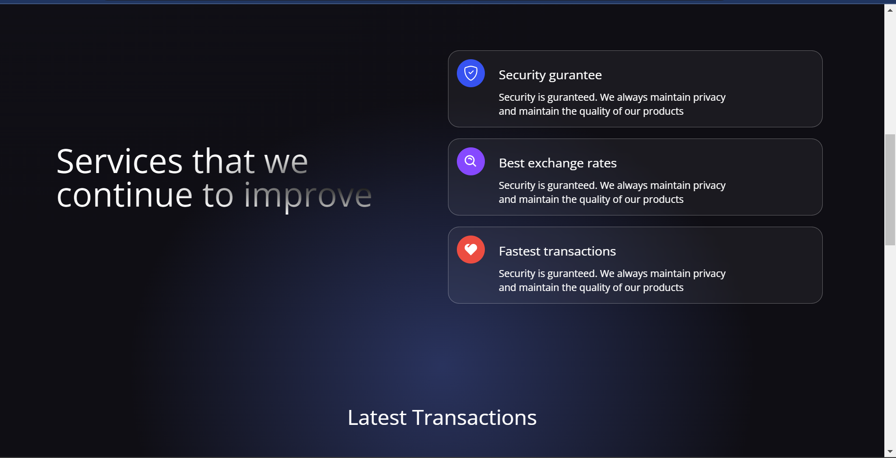
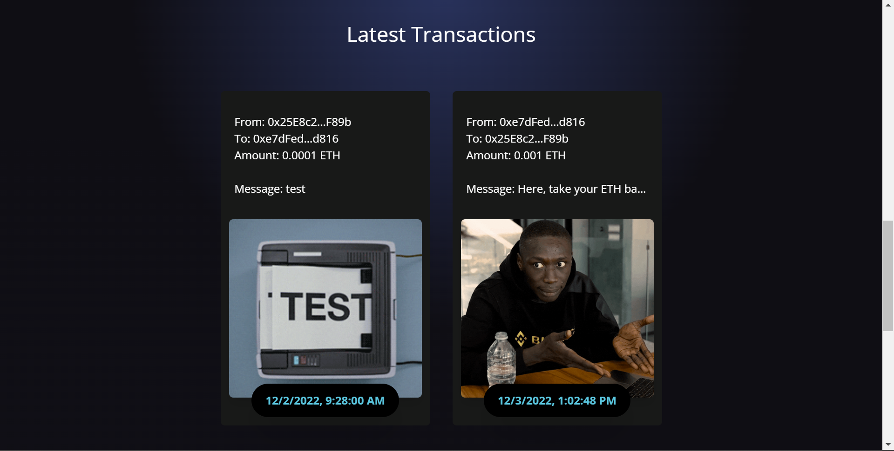
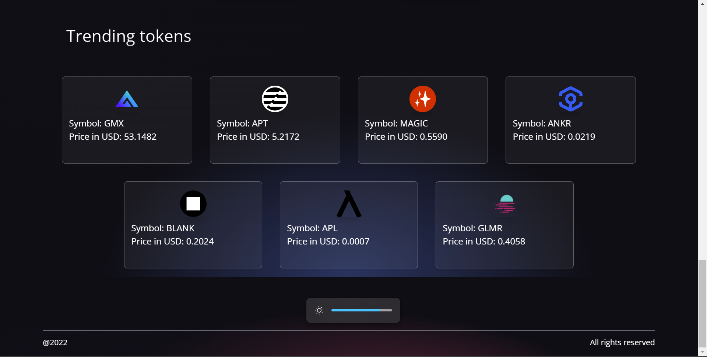

# Exchange Dapp

A simple exchange of tokens using React and Solidity.

Set-up
1.	install vite for fast initialization of dapp (instead of create-react-app)
<pre><code> 
npm init vite@latest
npm install
npm run dev - to start app
</code></pre>
2. Icons and ethers
<pre><code>
npm install react-icons ethers
</code></pre>

3. TailwindCSS install and set-up details available in <a href="https://tailwindcss.com/docs/guides/create-react-app" target="_blank"> TailwindCSS</a>

4. Other dependencies
<pre><code> npm install axios </code></pre>

##### Development: ReactJS, TailwindCSS
##### Web App Building: Vite 
##### APIs: CoinGecko, Alchemy, Giphy
###### Based-on: JavaScript Mastery
